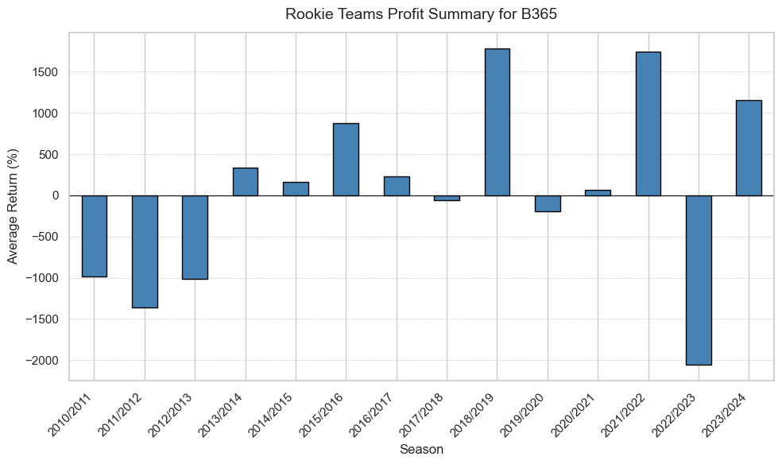

# premier-league-betting-insights
Historical analysis of a betting strategy that fades (bets against) every Premier League team. Shows strong profitability when targeting teams likely to be relegated. Includes rookie-team-based strategy and visualizations of returns by final league rank.

So the idea of this project is to explore whether there exist discrepencies in bookies odds by checking whether by betting against a specific team in premier league during seasons makes a profitable season. The analysis is done on from football-data \cite{https://www.football-data.co.uk/englandm.php} under seasons 10/11 - 23/24.

On to the analysis let's take Bet365 as an example, the patterns are almost the same among other bookies. The following graph displays the probability of having profitable season if if one bets on the same team's lossess throughout the whole season the x-axis is the final place of a team in a premier league season. Turns out "premier-league-betting-insights/exploratory_analysis
/graphs/probability_of_profit_B365.png". As we can see the if one bets on the a team that end up last one would be always in profit after a season. Betting on 18th and 19th has around 80% probability of profit.

Now on to the average profit 
"premier-league-betting-insights/exploratory_analysis
/graphs/average_profit_B365.png"
Logically the profit is the highest for the teams that ends on relegation palces 18th through 20th ranging around from 400% - 800% average return for one season averaged over 14 seasons with an average profit of 511.71%. This practically means that if one successfully choose a relagating team in seasons 10/11 - 23-24 one would expect to earn 511.71% if he bet against the same team the whole season the same ammount of money per match. Meaning if someone bet 100 euros per match one would have 511.71 euros at the end of the season.

Theoretical mathematical implication of this is that bookies systematically underestimates the probabilities of teams that will relegate that they'll loose. Because in long term this makes a profitable strategy hence according to Central Limit Theorem if bookies has the odds right we would not have profitable strategy.

Okay now we know that it is worth it bet against teams that will relegate in the Premier League but how to actually choose such a team? Let's implement a naive strategy and bet against rookie teams in each season. Such strategy is rather volatile as can be seen in the graph below.
exploratory_analysis/graphs/rookie_teams_strategy_B365.png
But the expected profit of such strategy would still be positive for the Bet365 specifically 49.57%. Hence there would be a need for more intelligent strategy rather that just picking a rookie team in order to reduce volatility.

I decided to test this on my local bookie during the season 2023/2024. I every match bet 1 euro on loose of Luton. At the end of the season I had 2,62 euros meaning meaning that this strategy had 162% profit. Luton ended up on 18th place and relegated.

# Premier League Betting Insights

This project explores the profitability of a betting strategy that fades (bets against) specific Premier League teams throughout a season. The analysis demonstrates that such a strategy, especially when targeting teams likely to be relegated, can yield consistent profits. It also introduces a simple rookie-team-based betting approach and provides visualizations of returns based on final league rankings.

## Objective

The goal is to investigate whether there are inefficiencies in bookmaker odds — specifically, whether consistently betting against certain Premier League teams can result in profitable outcomes over time.

To evaluate this, we use historical data from [football-data.co.uk](https://www.football-data.co.uk/englandm.php) covering Premier League seasons from 2010/11 to 2023/24.

## Profitability by Final League Rank

We analyze betting odds from Bet365 (patterns are similar across most bookmakers). The following graph shows the probability of ending a season in profit by betting on the **loss** of the same team in every match:

**Interpretation:**  
- Betting against the team that finishes **last (20th)** results in profit 100% of the time.  
- Teams finishing **18th or 19th** yield a profit around 80% of the time.

## Average Profit by Final League Rank

The graph below shows the **average return** from betting against teams based on their final league position:

**Key insights:**  
- Betting against relegated teams (positions 18th–20th) results in average returns of **400% to 800%** per season.  
- Over 14 seasons, the **average return** when betting against a relegated team is **511.71%**.

**Example:**  
If you bet €100 on each match against a team that eventually gets relegated, you would expect to earn approximately **€511.71** in profit by the end of the season.

## Theoretical Implications

This consistent profitability implies that bookmakers **underestimate the probability of relegation-prone teams losing**. In a well-calibrated market, such a strategy would not generate profit in the long run. According to the Central Limit Theorem, sustained profitability indicates a systemic inefficiency in odds-making.

## Rookie Team Strategy

To explore a simple predictive approach, we implement a naive strategy:  
> **Each season, bet against the newly promoted (rookie) teams.**

While more volatile, the following graph shows its performance:

- Despite the variance, this strategy has an **expected return of 49.57%** with Bet365 odds.
- However, the high volatility suggests the need for a more sophisticated selection method to minimize risk and improve stability.

## Real-World Test: Luton Town (2023/24)

During the 2023/24 season, I tested the strategy with my local bookmaker by betting **€1 against Luton Town** in every match.

- **Outcome:** Ended the season with **€2.62**, a **162% profit**.
- **Result:** Luton Town finished **18th** and were relegated.

## Summary

- Betting against relegation-bound teams in the Premier League can be highly profitable.
- Bookmakers may systematically misprice odds for weaker teams.
- Even a basic strategy (like targeting rookie teams) can be profitable, though more intelligent selection models are needed for consistency.

## Data Source

- [football-data.co.uk](https://www.football-data.co.uk/englandm.php)  
- Seasons: 2010/11 – 2023/24

---

Feel free to contribute by exploring smarter ways of identifying teams likely to be relegated!

